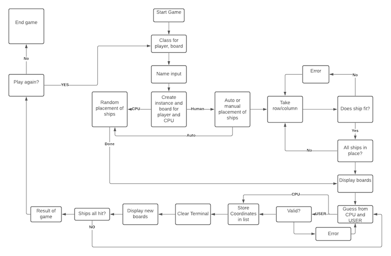
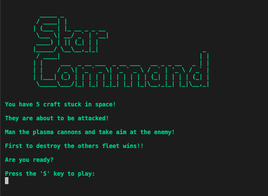
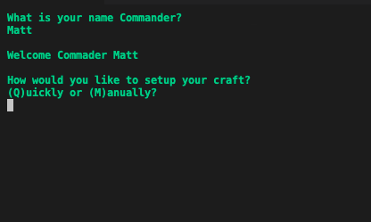
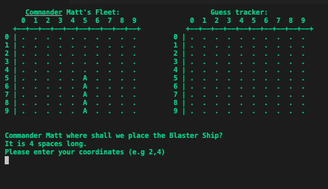
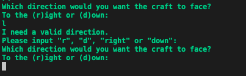
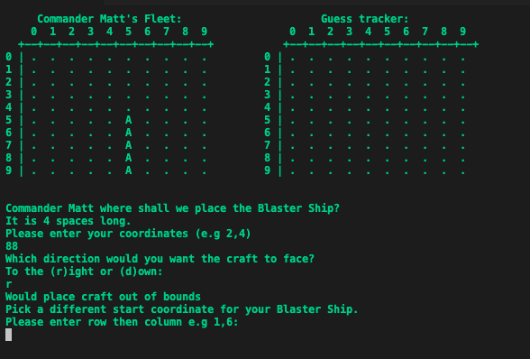
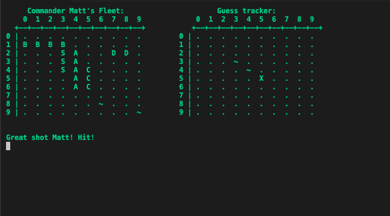
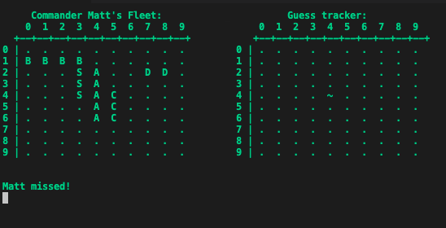
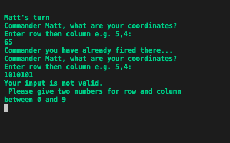

# **Battleships**

[View the live project here.](https://star-command.herokuapp.com/)

This program is a command-line version of the classic board game Battleships, deployed via the Heroku app. 
It is a single-player version of the game, playing against a computerised player. 

---

___

## **Table of Contents**
* [**Battleships**](#battleships)
* [**Planning**](#planning)
* [**Features**](#features)
* [**Data Model**](#data-model)
* [**Languages**](#languages)
* [**Libraries**](#libraries)
* [**Testing**](#testing)
    * [***Issues***](#issues)
* [**Further Testing**](#further-testing)
    * [***Known Bugs***](#known-bugs)
    * [***Improvements***](#improvements)
* [**Deployment**](#deployment)
* [**Credits**](#credits)
* [**Code**](#code)
    * [***Content***](#content)
    * [***Acknowledgements***](#acknowledgements)

# **Planning**
## ***User Stories:***
As a User, I want to be able to:
* Understand what the game is straight away.
* To have a fun time playing the game with easy to follow commands.

## ***Aim of Site***
1. Make it clear what the game is without need for explaination.
    * A welcome screen with ascii art and scrolling story will help achieve this.
1. Give a valid and clear response to all User input without the game crashing. 
    * All user input is handled and any exception is returned with a message to the User. 
1. Have an enjoyable experience of a classic kids game. 
    * The feedback given through the terminal without it getting cluttered on screen achieves this. 

## ***Flow Chart***
To explain the flow of the game, I created a flow chart:

# **Features**

## ***Welcome Screen:***
Here the User will be given a brief outline of the story and rules and will be prompted to start the game:

## ***Name Input/Setup:***
After being prompted for their name, the User will be asked if they wish to manually place their ships or allow the computer to do it for them:

## ***Manual placement:***
If the User selects to set up their fleet manually, they will be presented with a board to do so:

If the User puts in a invalid location they will be notified:

If their decision would place the craft out of bounds, the follwoing message will advise them such:

## ***Firing round:***

Once the User enters the firing round, they will be presented with a guess board and their own board with their fleet placed. They will be prompted for an input and will be advised if their chosen coordinates are a Hit:

Or a Miss:

They will also be advised of an invalid input:

## **Data Model**

To stay in line with the OOP requirements of the project, I decided to make classes for the Board, Player, Craft and Ships. There is also a Helper class that utilises functions that can be called among all classes. Even though people may see this as surplus to requirements, I feel that this was the best plan of action if I wanted to further develop the game at a later date. 

## **Languages** 

-   [Python](https://en.wikipedia.org/wiki/Python_(programming_language))

## **Libraries** 

    For this project to work successfully, I used the following imported libraries:

1. random:
    - randint used to generate a random integer between 0 and 9 for automated placement of craft and the computer hit guess.

1. time:
    - importing the sleep function from the this library enabled me to delay the typed reposnse to the console for a nicer game flow. It also enabled certain hit or miss statements to be viewed before the terminal was cleared for the reprinting of the boards. 

1. string:
    - I used the ".capwords()" function when a User enters their name to give them correct casing. 

1. os:
    - Used to clear the terminal so the screen could reset between input and keep everything clean.

---

## **Testing**

PEP8 online [(here)](http://pep8online.com/) was used to run through and check code met all validations and conventions. All pages passed with no issues, except for the "no newline at end of file" warning which is a known issue with this particualr CI template that I am using. 

---

## ***Issues***
    
1. AI was only placing ships horizontally. User unable to place ships vertically.
    
    * Indentation error in build_craft() was causing issue. 

2. When being placed automatically, the 5-tile craft would only place 2 tiles on a populated board. 

    * In the build_craft() fucntion, the y coordinate was using + 1 rather than + i, 
    causing it to be calculated as 2 tiles long. After chaning to + i, the issue was resolved. 

3. Game was not finished when all fleet was destroyed or all tiles filled. 

    * The check_shot() function in the Board class was looking at fleet_map for a result rather than fleet_coords that was in the class' __init__. 
    After updating this, the logic flow was completed to the is_fleet_destroyed function in the Game class and the game would complete. 

## **Further Testing**

-   The app was tested on Google Chrome, Firefox, Microsoft Edge and Safari browsers.
-   A large amount of testing was done to ensure that functionality was working as expected.
-   Friends and family members were asked to review the site and documentation to point out any bugs and/or user experience issues.

## ***Known Bugs***

-  If the User inputs their coordinates whilst it is the Computer's turn, their choice will still register. This will either result in an 'automatic' shot when it comes to their turn, or if they type more digits, a validation error. 

## ***Improvements***

-   I would like to implement addditional difficulty AI settings using a checkerboard technique for initial placement [(view)](https://www.youtube.com/watch?v=jMpbYpaKtao&ab_channel=KeithGalli), and an awareness to take shot at surrounding tiles once they have a hit. 
-   A 2-player functionality. 
-   The introduction of more colours in the game, with craft, hits and misses all being a different colour.

---
  
# **Deployment**

## ***Playing on a Local machine or via Gitpod Terminal:***
This project was developed by forking a [specialized Code Institute template](https://github.com/Code-Institute-Org/python-essentials-template) which simulates a terminal in the web browser. Due to this, I optimized the game to work via the [final Heroku deployment](https://dnlbowers-battleship.herokuapp.com/), and I do not recommend playing it locally. That said, I have included this section to give you a choice.  

1. Navigate to the [GitHub repository](https://github.com/dnlbowers/battleships), and follow [these steps to clone the project](https://docs.github.com/en/repositories/creating-and-managing-repositories/cloning-a-repository) into your IDE of choice.   
   
   * **Gitpod** only **requires** you to have the **web extension** installed and **click** the **green Gitpod button** from the repositories main page. If you are **using Gitpod** please **skip step 2** below as you do not require a virtual environment to protect your machine.  
  
1. **Create** the **virtual environment** with the terminal command **"python3 -m venv venv".** Once complete add the "venv" file to you're ".gitignore" file and use the terminal command **"venv\Scripts\activate.bat" to activate it.**
   
   * ***IMPORTANT*** If developing locally on your device, ensure you **set up/activate the virtual environment before installing/generating the requirements.txt file**; failure to do this will pollute your machine and put other projects at 
 
1. **Install the requirements** listed in requirements.txt using the terminal command  **"pip3 install -r requirements.txt"**
   * Kindly note that since I developed the project from scratch and installed the required libraries as progressed **I have already included a requirements.txt for this app** by using the terminal command **"pip3 freeze > requirements.txt"** to generate it.

## ***Final Deployment to Heroku:***  
  
The project was deployed to [Heroku](https://www.heroku.com) using the below procedure:-    
  
1. **Log in to Heroku** or create an account if required.
1. **click** the button labeled **New** from the dashboard in the top right corner, just below the header.
1. From the drop-down menu **select "Create new app"**.
1. **Enter a unique app name**. I combined my GitHub user name and the game's name with a dash between them (dnlbowers-battleship) for this project.
1. Once the web portal shows the green tick to confirm the name is original **select the relevant region.** In my case, I chose Europe as I am in Malta.
1.  When happy with your choice of name and that the correct region is selected, **click** on the **"Create app" button**.
1. This will bring you to the project "Deploy" tab. From here, navigate to the **settings tab** and scroll down to the **"Config Vars" section**. 
1. **Click** the button labelled **"Reveal Config Vars"** and **enter** the **"key" as port**, the **"value" as 8000** and **click** the **"add"** button.
1. Scroll down to the **buildpacks section of the settings page** and click the button labeled **" add buildpack," select "Python," and click "Save Changes"**.
1. **Repeat step 11 but** this time **add "node.js" instead of python**. 
   * ***IMPORTANT*** The buildpacks must be in the correct order. If node.js is listed first under this section, you can click on python and drag it upwards to change it to the first buildpack in the list.
1. Scroll back to the top of the settings page, and **navigate to the "Deploy" tab.**
1. From the deploy tab **select Github as the deployment method**.
1. **Confirm** you want to **connect to GitHub**.
1. **Search** for the **repository name** and **click** the **connect** button next to the intended repository.
1. From the bottom of the deploy page **select your preferred deployment type** by follow one of the below steps:  
   * Clicking either "Enable Automatic Deploys" for automatic deployment when you push updates to Github.  
   * Select the correct branch for deployment from the drop-down menu and click the "Deploy Branch" button for manual deployment. 
---

## **Credits**
* Everything you need to know about Classes in Python by Keith Galli was an extremely useful resource for me - [Here](https://youtu.be/tmY6FEF8f1o) 
* The idea to decorate the board with numbers for indexing the shots was from [Knowledge Mavens youtube channel](https://youtu.be/alJH_c9t4zw)
* Clear console function came from [Geeks for Geeks](https://www.geeksforgeeks.org/clear-screen-python/)
* [lucid chart.com](https://www.lucidchart.com/) was used to create the logic flow chart "flowchart.jpeg"
* [ASCII Art text generator](http://www.network-science.de/ascii/) used for the welcome screen text.
* [Hayoi's Programming Blog](https://www.lihaoyi.com/post/BuildyourownCommandLinewithANSIescapecodes.html) helped with the use of Unicode colour usage.
* To understand the game logic and how to go ahead with the build, I used this video on the [Devpost Youtube channel](https://youtu.be/zSQIGzmcp2I)  
* To better understand the enumerate() and zip() fucntions I came to [nkmk](https://note.nkmk.me/en/python-for-enumerate-zip/)

## **Code**

-   The idea for the project was inspired by a video by [Robert Heaton](https://www.youtube.com/watch?v=Gi0Fdyhk1_0&t=616s&ab_channel=RobertHeaton)

## ***Content***

-   All content was written by the Author, Matt Cooper, except where commented in the code or mentioned above. 

## ***Acknowledgements***

-   My Mentor Antonio Rodriguez for his continuous helpful feedback.

-   My partner Mor for her testing, suggestions and support throughout this build. 

-   The tutors at Code Institute for assisting me at the midnight hour of submission. 